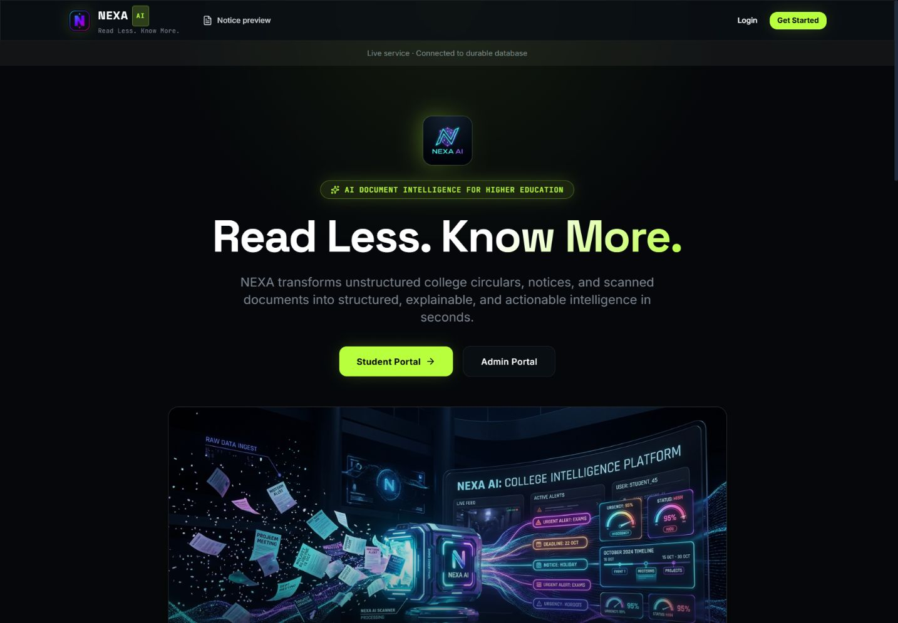
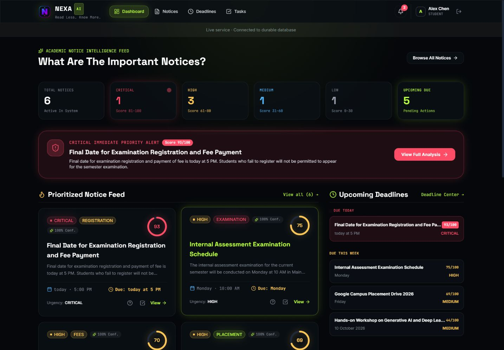
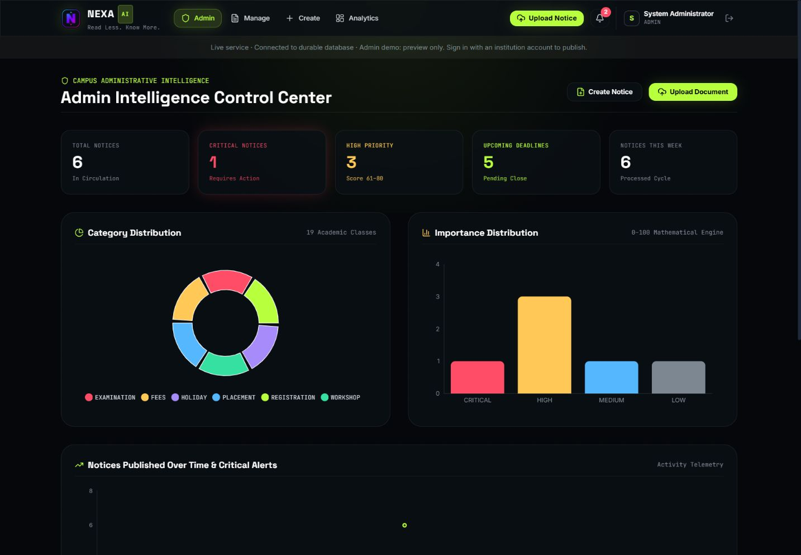

# NEXA — Campus Notice Intelligence

> Read less. Know more. Turn campus circulars into clear priorities, deadlines and actions.



**Live app:** [nexa-anjan.vercel.app](https://nexa-anjan.vercel.app)

**Download:** [latest release](https://github.com/codexanjan/nexa-ai-notice-analyzer/releases/latest). Choose the portable ZIP for the built interface and Windows launcher. See [download instructions](DOWNLOAD.md).

## Try before signing up

The home page explains both portals and includes a real text-analysis sandbox. Paste a circular to see its category, summary, importance, urgency and extracted actions. The classifier uses exported trained weights and transparent scoring rules. Verify dates and actions against the original circular. Initial campus notices are fictional samples.

## Student portal



**Your campus at a glance:** spot urgent notices, understand their importance, and see upcoming deadlines in one view. Screenshots use fictional demo notices.

- Search and filter published notices by category, importance and urgency.
- Read summaries and explanations of each priority score.
- Save notice actions or custom tasks to your personal taskboard and track completion.
- Review deadline groups and in-app alerts. Read states belong to each user.
- The notice feed and alert bell refresh every 15 seconds using polling.

[Student sign-in](https://nexa-anjan.vercel.app/login?portal=student)

## Administrator portal



**From circular to campus update:** analyze documents, manage publishing and review notice trends. The screenshot shows the public read-only admin preview.

- Separate navigation for dashboard, notice management, creation, upload and analytics.
- Analyze digital PDFs, DOCX documents (including tables) and TXT files.
- Create, edit, save drafts, publish, archive and delete notices.
- Review category and importance analytics.
- Only institution administrators can change notices. Public registration creates student accounts.

[Administrator sign-in](https://nexa-anjan.vercel.app/login?portal=admin)

## Demo access

Use Student Demo or Admin Demo on the sign-in page to fill credentials, then sign in.

| Account | Email | Password |
| --- | --- | --- |
| Shared student demo | student@nexa.edu | student123 |
| Admin preview demo | admin@nexa.edu | admin123 |

The public admin demo is read-only with a durable database. Create a personal student account for your own tasks. Do not place private information in shared demo accounts.

## Google sign-in

Google Identity Services is integrated into sign-in and registration. The backend verifies Google signatures, audience, expiry, verified email and a short-lived sign-in nonce before issuing a NEXA session. New accounts receive **student** access. Existing accounts must provide their NEXA password on the first Google sign-in to link safely; their role stays unchanged. Returning linked users need only Google.

To activate it, create a **Web application** OAuth client in [Google Cloud](https://console.cloud.google.com/auth/clients), configure your consent screen, and add `https://nexa-anjan.vercel.app` to **Authorized JavaScript origins**. Set `GOOGLE_CLIENT_ID` in Vercel Production and redeploy. No client secret or redirect URI is needed for this popup credential flow. For local development, also allow `http://localhost:5173` (or the exact origin you use). While the Google app is in testing, add permitted test users; publish its consent configuration for public access.

Without a configured client ID, the app clearly states that Google sign-in is pending and keeps email/demo sign-in available. Real Google account sign-in requires a valid client ID and authorized origin; mocked backend tests do not replace that final live check.

## Production storage

Production uses a dedicated Neon PostgreSQL database through Vercel's existing free integration. Accounts, notices, tasks and notification read states persist across deployments. MongoDB and a local JSON development store are also supported.

Production environment variables:

- `DATABASE_URL` from Neon, or `MONGODB_URI` for MongoDB.
- `SECRET_KEY`: a private random signing key configured in the host, never source control.
- `ADMIN_EMAIL` and `ADMIN_PASSWORD`: provision a private administrator at startup. Use different credentials from the public demo.

`GET /api/health` reports database, durability and live/demo mode. Without a production database, the UI warns that changes are temporary. A configured connection failure does not silently fall back to temporary storage.

## Document limitations

Digital PDF, DOCX and TXT extraction is tested. Image OCR needs optional RapidOCR or an installed Tesseract engine; these are not included in this Vercel release. Image and scanned PDF uploads return a clear extraction error rather than fabricated content. Legacy `.doc` and unsupported types are rejected. Uploads are limited to 10 MB.

## Develop and verify

Use Python 3.12 and Node.js 24.

```powershell
python -m pip install -r requirements.txt
python -m pytest backend/tests -q
cd frontend
npm ci
npm run build
npm run lint
```

Start `python -m uvicorn app.main:app --port 8000` from `backend` and `npm run dev` from `frontend`. The frontend proxies `/api` to port 8000.

Tests isolate storage and cover NLP/scoring, authentication, role escalation, task ownership, draft visibility, notification isolation, numeric sorting, digital documents and OCR failure. The production build checks TypeScript. Existing lint warnings and build-tool dependency advisories remain; the frontend runtime dependency audit reports no advisories.

## Version 1.1.0

Fixes prototype access controls and persistence, adds portal showcases, notice editing/status management, automatic feed refresh and visible errors, and loads administrator charts only when needed.
